<h1 align="center"> Hi there 👋, I'm Arthur </h1>

- 💻 Fresh AMD GPU DevTech fellow 🥳.
- 🎓 Computer Science Master Student enrolled at both the [National University of Singapore](https://nus.edu.sg/) and [Telecom Paris](https://www.telecom-paris.fr/).
- 🔭 Specialized in Real-Time Rendering for Computer Graphics.

  
  

<h2 align="center"> 🌱 Currently </h2>

- 🧊 Learning about GPU architecture and DirectX 12.
- 🧰 Developping [Caduq](https://github.com/Touklakoss-inc/Caduq) a CAD software, focusing on the rendering engine.

<h2 align="center"> 💼 Projects </h2>

- 📝 Master's Thesis on on Fixed GPU Memory Budget Streamed Gaussian Splatting at NUS.
- 🧊 Learned to build a [Simple 2D Game Engine](https://github.com/arthur-wuhrlin/Simple-Game-Engine) using OpenGL.
- 🌊 Simulated [Ocean Surface](https://github.com/arthur-wuhrlin/Simple-Game-Engine/tree/fft-ocean) using GPU based IFFT and wave spectrum synthesis, added a simple 3D Renderer to the previously built Game Engine.
- 🎮 Developped [GlassOverflow](https://github.com/Skyepulse/FluidSimulatorGame) a game focused on Real-Time 2D fluid simulation build without any engine.
- 📄 More projects on my [Website](https://arthur-wuhrlin.github.io).

<h2 align="center"> 🌐 Connect with Me </h2>

- Via mail : [name].[surname] [at] u.nus.edu.
- Via [LinkedIn](https://www.linkedin.com/in/arthur-wuhrlin/).
- For more information check my [Website](https://arthur-wuhrlin.github.io).
